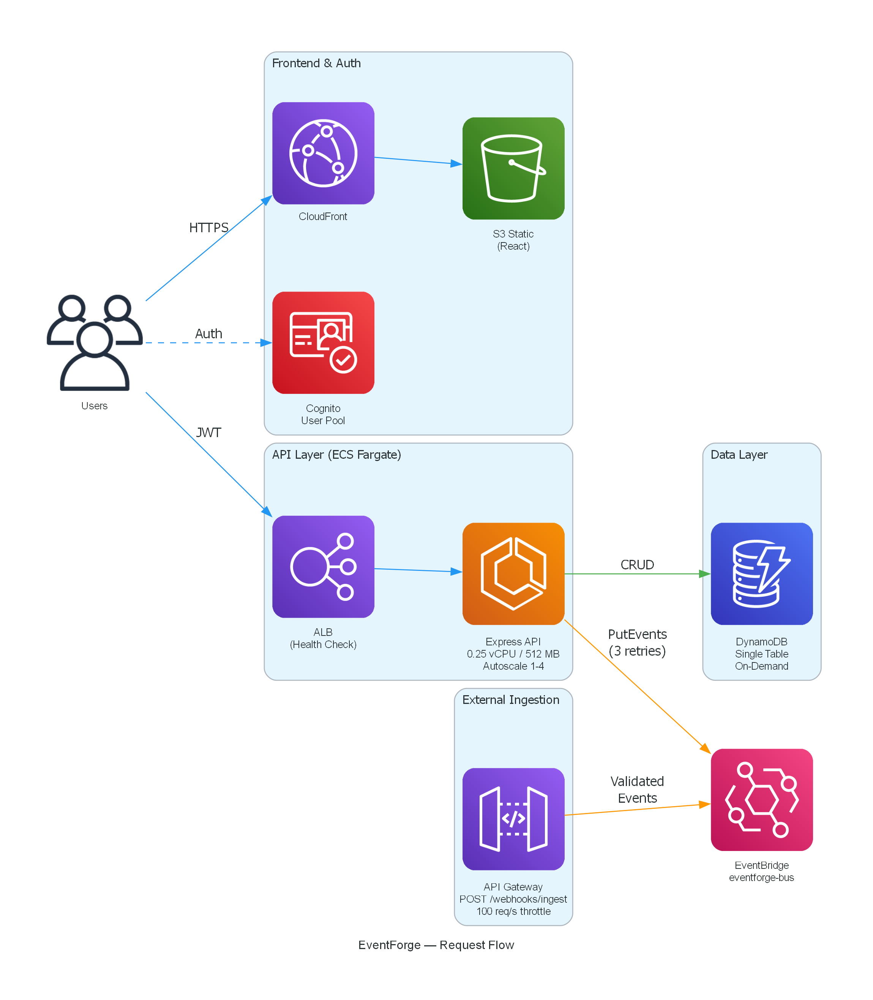

# EventForge

A hybrid event processing platform that demonstrates when to use **containers** (ECS Fargate) versus **serverless** (Lambda) in the same system. Built for AWS with TypeScript throughout.

The API layer runs on ECS Fargate for consistent sub-200ms responses. Background processing runs on Lambda triggered by SQS queues for scale-to-zero economics. Step Functions orchestrates multi-step order workflows using the saga pattern with compensation.

## Architecture

EventForge is split into three architectural layers. Each diagram below shows one layer in detail.

### Request Flow

Users interact with the platform through a React dashboard (S3/CloudFront) and the REST API (ECS Fargate behind ALB). All state changes publish events to a central EventBridge bus. External systems push events via API Gateway.



### Order Processing Workflow

When an order is created, EventBridge triggers a Step Functions state machine that executes the saga pattern: Validate → Reserve Inventory → Charge Payment → Confirm. If any step fails after inventory is reserved, the workflow compensates by releasing inventory before marking the order as failed.


### Background Processing & Observability

Completed orders fan out to SQS queues for email confirmation, PDF receipt generation, and webhook delivery. Each queue has a dead-letter queue with CloudWatch alarms. X-Ray traces the full request path across all services.


## Why Containers AND Serverless

| Concern | ECS Fargate | Lambda |
|---------|-------------|--------|
| API responses | Consistent sub-200ms, no cold starts | Cold starts add 500ms-3s |
| Always-on traffic | Predictable cost at sustained load | Expensive at high RPS |
| Background processing | Over-provisioned, paying for idle | Scale to zero, pay per invocation |
| Bursty workloads | Slow to scale (minutes) | Instant scale (milliseconds) |

EventForge uses both correctly: **Fargate for the API** (latency-sensitive, always-on) and **Lambda for background tasks** (bursty, event-driven).

## Tech Stack

| Layer | Technology |
|-------|-----------|
| API | TypeScript, Express, ECS Fargate |
| Event Processors | TypeScript Lambda functions |
| Workflow | Step Functions (saga pattern) |
| Event Bus | EventBridge (custom bus) |
| Queues | SQS (standard + DLQ) |
| Database | DynamoDB (single-table, on-demand) |
| Auth | Cognito (JWT) |
| Frontend | React (S3 + CloudFront) |
| Observability | X-Ray + CloudWatch Alarms |
| IaC | AWS SAM / CloudFormation |

## Project Structure

```
EventForge/
├── packages/
│   ├── api/          # Express REST API (ECS Fargate)
│   ├── lambdas/      # All Lambda functions (workflow + processors)
│   ├── shared/       # DynamoDB data layer, types, utilities
│   ├── frontend/     # React dashboard
│   └── infra/        # SAM/CloudFormation templates
├── docs/             # Architecture diagrams (code + images)
├── template.yaml     # Root SAM template (nested stacks)
├── jest.config.js    # Test configuration
└── tsconfig.json     # TypeScript project references
```

## Quick Start

### Prerequisites

- Node.js 20+
- AWS CLI configured
- AWS SAM CLI
- Docker (for local ECS testing)

### Install & Build

```bash
npm install
npm run build
```

### Run Tests

```bash
npm test
```

343 tests across 35 suites, including 19 property-based tests (100 iterations each).

### Deploy

```bash
sam deploy --guided
```

The root `template.yaml` deploys all infrastructure in the correct dependency order via nested stacks.

## API Endpoints

| Method | Path | Description |
|--------|------|-------------|
| POST | /api/orders | Create order (publishes order.created event) |
| GET | /api/orders | List user's orders (max 50, sorted desc) |
| GET | /api/orders/:id | Get order with event history |
| GET | /api/orders/:id/receipt | Presigned URL for PDF receipt |
| POST | /api/webhooks | Register webhook URL for delivery |
| GET | /api/events | Recent events (max 100, for dashboard) |
| GET | /health | Health check (no auth) |
| POST | /webhooks/ingest | External event ingestion (API Gateway) |

## Key AWS Services

- **ECR + ECS Fargate** — Container registry and API runtime
- **ALB** — Load balancing with health checks
- **Lambda** — Event processors and workflow steps
- **Step Functions** — Order workflow orchestration
- **EventBridge** — Central event bus with content-based routing
- **SQS** — Queue decoupling with dead-letter queues
- **DynamoDB** — Single-table design with GSIs
- **Cognito** — User authentication (JWT)
- **S3 + CloudFront** — Frontend hosting and receipt storage
- **X-Ray** — Distributed tracing
- **CloudWatch** — Alarms on DLQ depth

## Cost Estimate

| Resource | Monthly (dev) | Free Tier |
|----------|--------------|-----------|
| ECS Fargate (2 tasks) | ~$18 | No |
| ALB | ~$16 | No |
| Lambda | ~$0 | 1M requests |
| Step Functions | ~$0 | 4K transitions |
| EventBridge | ~$0 | 14M events |
| SQS | ~$0 | 1M requests |
| DynamoDB | ~$0 | 25 GB |
| **Total** | **~$35/month** | |

Tear down ECS + ALB when not using to stay under $5/month.


## License

MIT
