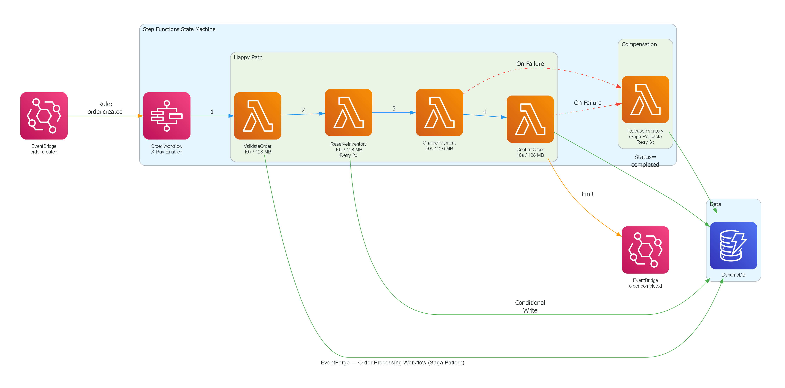
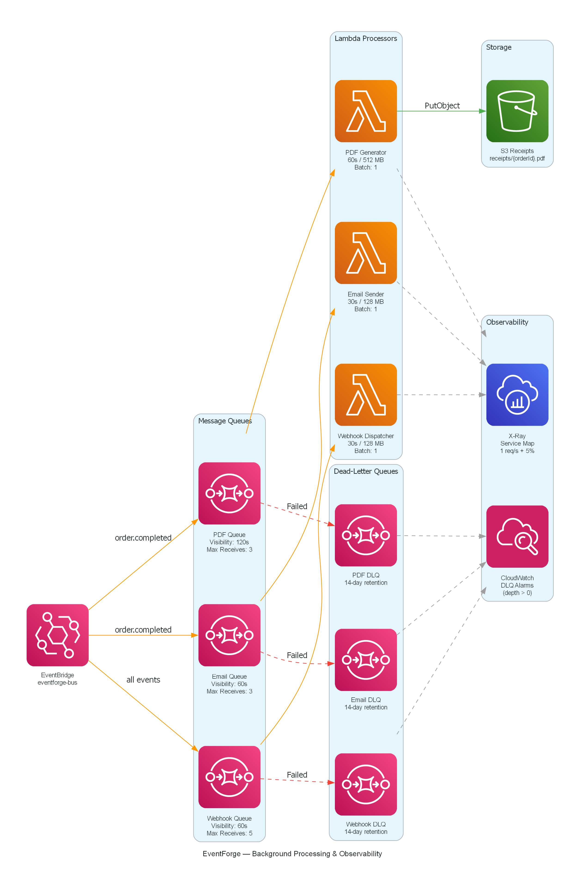

# EventForge

Hybrid event processing platform on AWS. Containers and serverless working together in one system.

## The problem I solved

Every AWS project I've seen picks either containers or serverless. But real production systems need both. The API needs consistent latency (no cold starts), so it belongs on ECS Fargate. Background processing is bursty and intermittent, so Lambda with scale-to-zero is the right fit.

I built EventForge to demonstrate this decision in a working system, not just talk about it in an interview.

## What it does

EventForge processes e-commerce orders through a multi-step workflow:

1. User places an order through the REST API (ECS Fargate)
2. API publishes an event to EventBridge
3. Step Functions picks it up and runs the saga: validate, reserve inventory, charge payment, confirm
4. If payment fails after inventory is reserved, the workflow compensates by releasing the reservation
5. On success, EventBridge fans out to SQS queues for email confirmation, PDF receipt generation, and webhook delivery
6. Each processor is a Lambda function with its own dead letter queue

X-Ray traces the full path. CloudWatch alarms fire if anything lands in a dead letter queue.

## Architecture

## Technical decisions

**ECS Fargate for the API** because it needs sub-200ms responses at all times. Autoscales between 1-4 tasks based on CPU. Runs in private subnets behind an ALB.

**Lambda for background work** because email, PDF generation, and webhook delivery are bursty. No point paying for idle containers when these fire a few times per hour.

**Step Functions for the workflow** because I needed retry logic, error handling, and compensation (saga pattern) without writing a custom state machine. The ASL definition is version controlled and X-Ray traced.

**DynamoDB single table design** because the access patterns are predictable: get order by ID, list user's orders, store events by timestamp. Conditional writes handle idempotency. TTL cleans up stale locks.

**EventBridge as the event bus** because it decouples the API from everything downstream. The API doesn't know (or care) what happens after it publishes an event.

## What I built

- TypeScript monorepo (5 packages: api, lambdas, shared, frontend, infra)
- Express REST API with JWT auth (Cognito), presigned S3 URLs, X-Ray tracing
- 10 Lambda functions (6 workflow steps + 3 processors + 1 ingestion handler)
- Step Functions state machine with saga pattern and compensation
- React dashboard with Cognito authentication and 10-second polling
- 11 CloudFormation templates deployed as nested stacks
- 343 tests including 19 property-based tests (fast-check, 100 iterations each)
- Multi-stage Docker build for production deployment
- Full observability: X-Ray distributed tracing, CloudWatch alarms on DLQ depth

## AWS services used

ECS Fargate, Lambda, Step Functions, EventBridge, SQS, DynamoDB, Cognito, S3, CloudFront, API Gateway, ALB, ECR, X-Ray, CloudWatch, SNS, IAM, VPC

## Links

- [GitHub Repository](https://github.com/suletetes/EventForge)
- [Architecture Diagrams](https://github.com/suletetes/EventForge/tree/main/docs)

## Tech stack

TypeScript, Express, React, AWS SAM, CloudFormation, Docker, Jest, fast-check
